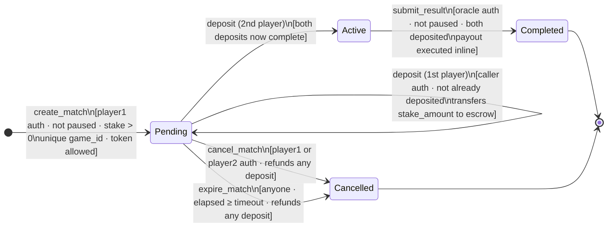

# Match Lifecycle State Machine

This document describes every state, transition, guard condition, error path, and timing window in the Checkmate-Escrow match lifecycle.

## ASCII Diagram

```
                          create_match
                          [player1 auth; not paused;
                           stake > 0; unique game_id;
                           token allowed]
                                │
                                ▼
                    ┌───────────────────────┐
                    │        Pending        │
                    │  (awaiting deposits)  │◄──────────────────────┐
                    └───────────────────────┘                        │
                          │        │    │                            │
             deposit      │        │    │ deposit                    │ deposit
             (player1)    │        │    │ (player2)                  │ (other player)
             [p1 not yet  │        │    │ [p2 not yet deposited]     │ [not yet deposited]
              deposited]  │        │    │                            │
                          ▼        │    ▼                            │
                  p1_deposited=T   │  p2_deposited=T─────────────────┘
                  (still Pending)  │  (still Pending)
                                   │
                    cancel_match ──┤  expire_match
                    [player1 or    │  [anyone; elapsed ≥ timeout]
                     player2 auth] │
                          │        │
                          ▼        ▼
                    ┌───────────────────────┐
                    │       Cancelled       │
                    │  (terminal; refunded) │
                    └───────────────────────┘

                    When both p1_deposited AND p2_deposited = true:
                          │
                          ▼
                    ┌───────────────────────┐
                    │        Active         │
                    │  (game in progress)   │
                    └───────────────────────┘
                          │
              submit_result / submit_result_with_oracle_record
              [oracle auth; not paused; both deposited]
                          │
                    ┌─────┴──────────────────────┐
                    │                            │
              winner = Player1            winner = Draw
              winner = Player2
                    │                            │
                    ▼                            ▼
          pot (2×stake) → winner       stake → player1
                                        stake → player2
                    │                            │
                    └─────────┬──────────────────┘
                              ▼
                    ┌───────────────────────┐
                    │       Completed       │
                    │  (terminal; paid out) │
                    └───────────────────────┘
```

## Mermaid Diagram



## State Descriptions

| State | Deposit flags | Funds in escrow | Notes |
|---|---|---|---|
| `Pending` | 0, 1, or 2 set | 0, 1×stake, or 2×stake | Cancellable by either player; expirable by anyone after timeout |
| `Active` | both true | 2×stake | Game in progress; only oracle can advance |
| `Completed` | both true | 0 (paid out) | Terminal. `completed_ledger` is set. |
| `Cancelled` | any | 0 (refunded) | Terminal. `completed_ledger` is set. |

## State Transition Guards

### `create_match` → `Pending`

| Guard | Error if violated |
|---|---|
| `player1.require_auth()` | `Unauthorized` (tx fails) |
| Contract not paused | `ContractPaused` |
| `stake_amount > 0` | `InvalidAmount` |
| `game_id` non-empty and ≤ max length | `InvalidGameId` |
| `game_id` not already registered | `DuplicateGameId` |
| `player1 ≠ player2` | `InvalidPlayers` |
| `player2 ≠ contract address` | `InvalidPlayers` |
| Token on allowlist (only when allowlist is enforced) | `TokenNotAllowed` |
| Match ID not already occupied | `AlreadyExists` |

### `deposit` (1st player) → `Pending` (partial funding)

| Guard | Error if violated |
|---|---|
| `player.require_auth()` | `Unauthorized` (tx fails) |
| Contract not paused | `ContractPaused` |
| Match exists | `MatchNotFound` |
| `match.state == Pending` | `InvalidState` |
| Caller is `player1` or `player2` | `Unauthorized` |
| Caller has not already deposited | `AlreadyFunded` |
| Token transfer succeeds (sufficient balance + allowance) | token contract error |

### `deposit` (2nd player) → `Active`

Same guards as above. Transition to `Active` is automatic when both `player1_deposited` and `player2_deposited` become `true` within the same call.

### `cancel_match` → `Cancelled`

| Guard | Error if violated |
|---|---|
| Match exists | `MatchNotFound` |
| `match.state == Pending` (not `Active`) | `MatchAlreadyActive` if Active; `InvalidState` for other states |
| Caller is `player1` or `player2` | `Unauthorized` |
| `caller.require_auth()` | `Unauthorized` (tx fails) |

Refund behaviour: if `player1_deposited` → transfer `stake_amount` back to `player1`; if `player2_deposited` → transfer `stake_amount` back to `player2`.

### `expire_match` → `Cancelled`

| Guard | Error if violated |
|---|---|
| Match exists | `MatchNotFound` |
| `match.state == Pending` | `InvalidState` |
| `env.ledger().sequence() − created_ledger ≥ timeout` | `MatchNotExpired` |

No caller authorization required — anyone can expire an overdue match.

Refund behaviour: same as `cancel_match`.

### `submit_result` → `Completed`

| Guard | Error if violated |
|---|---|
| Contract not paused | `ContractPaused` |
| Oracle address is configured | `Unauthorized` |
| `oracle.require_auth()` | `Unauthorized` (tx fails) |
| Match exists | `MatchNotFound` |
| `match.state == Active` | `InvalidState` |
| Both deposit flags are `true` | `NotFunded` |
| Token transfers succeed | token contract error (overflow guard: `stake × 2` checked) |

Payout rules:
- `Winner::Player1` → `2 × stake_amount` to `player1`
- `Winner::Player2` → `2 × stake_amount` to `player2`
- `Winner::Draw` → `stake_amount` to each player

## Timing Windows

All timing is expressed in ledger sequence numbers. At 5 s/ledger:

| Constant | Ledgers | Approximate wall-clock time |
|---|---|---|
| `MIN_MATCH_TIMEOUT_LEDGERS` | 17,280 | 1 day |
| `DEFAULT_MATCH_TIMEOUT_LEDGERS` | 518,400 | ~30 days |
| `MAX_MATCH_TIMEOUT_LEDGERS` | 1,555,200 | ~90 days |
| Match/index TTL (`MATCH_TTL_LEDGERS`) | 518,400 | ~30 days |

The configurable timeout (`set_match_timeout`, admin-only) controls when `expire_match` becomes callable. It defaults to `DEFAULT_MATCH_TIMEOUT_LEDGERS` (~30 days) and must stay within `[MIN, MAX]`.

```
created_ledger                    created_ledger + timeout
      │                                    │
      ▼                                    ▼
──────●────────────────────────────────────●──────────────────►  ledger sequence
      │◄───────── expire_match blocked ───►│◄── expire_match allowed
```

Match records in persistent storage share the same ~30-day TTL, extended on every write. If a match has no activity for ~30 days, its storage entry may expire and `get_match` will return `MatchNotFound`.

## Error Path Summary

| Caller action | Likely error | Root cause & recovery |
|---|---|---|
| Call `deposit` after both already deposited | `AlreadyFunded` | Both deposits are complete; match is `Active`. No action needed. |
| Call `deposit` on an `Active` match | `InvalidState` | Match already fully funded. |
| Call `cancel_match` on an `Active` match | `MatchAlreadyActive` | Cannot cancel once both players have deposited. |
| Call `expire_match` before timeout elapses | `MatchNotExpired` | Wait until `created_ledger + timeout` ledgers have passed. |
| Call `submit_result` from a non-oracle address | `Unauthorized` | Only the configured oracle address can submit results. |
| Call `submit_result` while contract is paused | `ContractPaused` | Admin must unpause the contract first. |
| Call `create_match` with a duplicate `game_id` | `DuplicateGameId` | Use a fresh, unique game ID from the chess platform. |
| Call `create_match` with a disallowed token | `TokenNotAllowed` | Admin must add the token via `add_allowed_token`, or use a listed token. |

## Events Emitted per Transition

| Transition | Event topic | Payload |
|---|---|---|
| `create_match` | `match` / `created` | `(match_id, player1, player2, stake_amount)` |
| `deposit` (partial) | `match` / `deposit` | `(match_id, player, None)` |
| `deposit` (activating) | `match` / `deposit` | `(match_id, player, Some(Active))` |
| `deposit` (activating) | `match` / `activated` | `match_id` |
| `submit_result` | `match` / `completed` | `(match_id, winner)` |
| `cancel_match` | `match` / `cancelled` | `match_id` |
| `expire_match` | `match` / `expired` | `match_id` |

## Balance Snapshots

At every lifecycle transition a `BalanceSnapshot` is written to a ring buffer (capacity: 8 entries per match). Snapshots are keyed by `(match_id, slot)` and record:

| Reason | Taken at |
|---|---|
| `Created` | `create_match` |
| `Deposit` | each `deposit` call |
| `Completed` | `submit_result` |
| `Cancelled` | `cancel_match` or `expire_match` |

Use `get_snapshot(match_id, index)` for audit trails without relying on off-chain event logs.

## Cross-References

- Implementation: [`contracts/escrow/src/lib.rs`](../contracts/escrow/src/lib.rs)
- Types: [`contracts/escrow/src/types.rs`](../contracts/escrow/src/types.rs)
- Error codes: [`docs/error-codes.md`](error-codes.md)
- Architecture overview: [`docs/architecture.md`](architecture.md)
- Oracle design: [`docs/oracle.md`](oracle.md)
